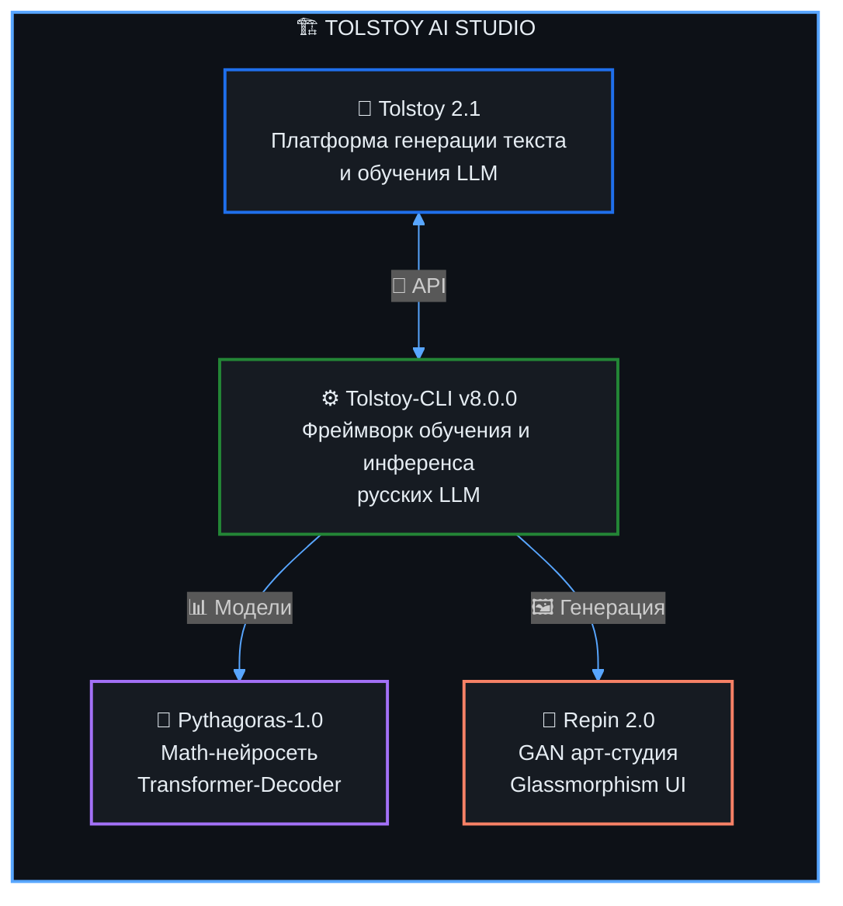

<div align="center">

<!-- Волновой баннер -->


<!-- Анимированный текст -->
<a href="https://git.io/typing-svg">
  
</a>

<!-- Контактные бейджи -->
<p>
  <a href="https://t.me/ultrahyperus"></a>
  <a href="mailto:takeshelgaas@gmail.com"></a>
  <a href="https://github.com/zzzigrok"></a>
</p>

<!-- Счётчик посещений -->


</div>

<!-- ═══════════════════════════════════════════════════════════ -->

## 👨‍💻 &nbsp;Обо мне

```yaml
name:       Григорий Романов
location:   Москва, Россия 🇷🇺
education:  Технологический университет им. Леонова
role:       AI Engineer & LLM Developer
philosophy: "Building things that think"
```

Занимаюсь проектированием **автономных AI-систем**, которые работают на потребительском железе — без облаков и подписок. Основной фокус — обучение и инференс русскоязычных LLM, нейросетевые архитектуры (Transformer, GAN) и инструменты разработчика.

<table>
  <tr>
    <td>🔭</td>
    <td><b>Сейчас развиваю</b></td>
    <td><code>Tolstoy AI Studio</code> — комплексную экосистему для русскоязычных LLM</td>
  </tr>
  <tr>
    <td>🧠</td>
    <td><b>В фокусе</b></td>
    <td>llama.cpp, MoE, GQA, RoPE, Transformer-архитектуры, GAN</td>
  </tr>
  <tr>
    <td>🎓</td>
    <td><b>Интересы</b></td>
    <td>Высшая математика, проектирование AI-систем, оптимизация алгоритмов</td>
  </tr>
  <tr>
    <td>⚡</td>
    <td><b>Инструменты</b></td>
    <td>WSL 2, CMake, OpenRouter API, Polza.ai</td>
  </tr>
</table>

<!-- ═══════════════════════════════════════════════════════════ -->

## 🛠️ &nbsp;Технологический стек

<div align="center">

#### Языки программирования
<p>
  
  
  
  
</p>

#### AI / ML / Deep Learning
<p>
  
  
  
  
</p>

#### Инфраструктура и инструменты
<p>
  
  
  
  
  
</p>

#### Веб-технологии
<p>
  
  
  
  
</p>

</div>

<!-- ═══════════════════════════════════════════════════════════ -->

## 🚀 &nbsp;Ключевые проекты

### 🧩 Экосистема Tolstoy AI Studio

> Автономная мультимодальная AI-экосистема — от генерации текста до математической логики и графики.  
> Все компоненты работают **локально на потребительском железе**.



<table>
<tr>
<td width="50%">

#### <a href="https://github.com/zzzigrok/Tolstoy-CLI">⚙️ Tolstoy-CLI v8.0.0</a>
> Ультимативный фреймворк для обучения и инференса русскоязычных LLM на потребительском железе.

<p>
  
  
  
</p>

`Fine-tuning` `GGUF` `Quantization` `LoRA`

</td>
<td width="50%">

#### <a href="https://github.com/zzzigrok/tolstoy-2.1">🚀 Tolstoy 2.1</a>
> Профессиональная платформа для генерации текста и обучения LLM с премиальным веб-интерфейсом.

<p>
  
  
  
</p>

`Web Platform` `LLM` `GitHub Pages`

</td>
</tr>
<tr>
<td width="50%">

#### <a href="https://github.com/zzzigrok/Pythagoras-1.0">📐 Pythagoras-1.0</a>
> Специализированная математическая нейросеть на архитектуре Transformer-Decoder.

<p>
  
  
  
</p>

`Transformer` `Mathematics` `Deep Learning`

</td>
<td width="50%">

#### <a href="https://github.com/zzzigrok/repin-2.0">🎨 Repin 2.0</a>
> Мощная арт-студия на базе GAN с веб-витриной в стиле Glassmorphism и CLI.

<p>
  
  
  
</p>

`GAN` `Generative AI` `Glassmorphism`

</td>
</tr>
</table>

---

### 🔧 Инженерные инструменты

<table>
<tr>
<td width="33%">

#### <a href="https://github.com/zzzigrok/chaoswire">🌀 ChaosWire</a>
> Программируемый хаос-прокси L4/L7 на Go 1.24

<p>
  
  
</p>

Инъекция задержек, сброс соединений и ограничение полосы без перезапуска — через REST API или CLI.

`TCP` `HTTP` `Chaos Engineering` `Fault Injection`

</td>
<td width="33%">

#### <a href="https://github.com/zzzigrok/chitai-gorod-parser">📚 Chitai-Gorod Parser</a>
> Модульный асинхронный парсер книг

<p>
  
  
</p>

HTTP/2, ротация прокси, Playwright fallback, экспорт в CSV/XLSX.

`asyncio` `httpx` `Playwright` `Scraping`

</td>
<td width="33%">

#### <a href="https://github.com/zzzigrok/repogroomer">🧹 RepoGroomer</a>
> Локальный менеджер репозиториев

<p>
  
  
</p>

Найди мёртвые проекты, очисти кэш зависимостей, освободи место на диске.

`CLI` `DevTools` `Automation`

</td>
</tr>
</table>

<!-- ═══════════════════════════════════════════════════════════ -->

## 📊 &nbsp;GitHub Статистика

<div align="center">


&nbsp;&nbsp;&nbsp;


<br/><br/>

<!-- Streak -->


<br/><br/>

<!-- Activity Graph -->


</div>

<!-- ═══════════════════════════════════════════════════════════ -->

## 🐍 &nbsp;Контрибуции

<div align="center">
<picture>
  <source media="(prefers-color-scheme: dark)" srcset="https://raw.githubusercontent.com/zzzigrok/zzzigrok/output/github-snake-dark.svg" />
  <source media="(prefers-color-scheme: light)" srcset="https://raw.githubusercontent.com/zzzigrok/zzzigrok/output/github-snake.svg" />
  
</picture>
</div>

<!-- ═══════════════════════════════════════════════════════════ -->

<div align="center">

## 💡 &nbsp;Цитата дня


<br/><br/>

---


</div>
