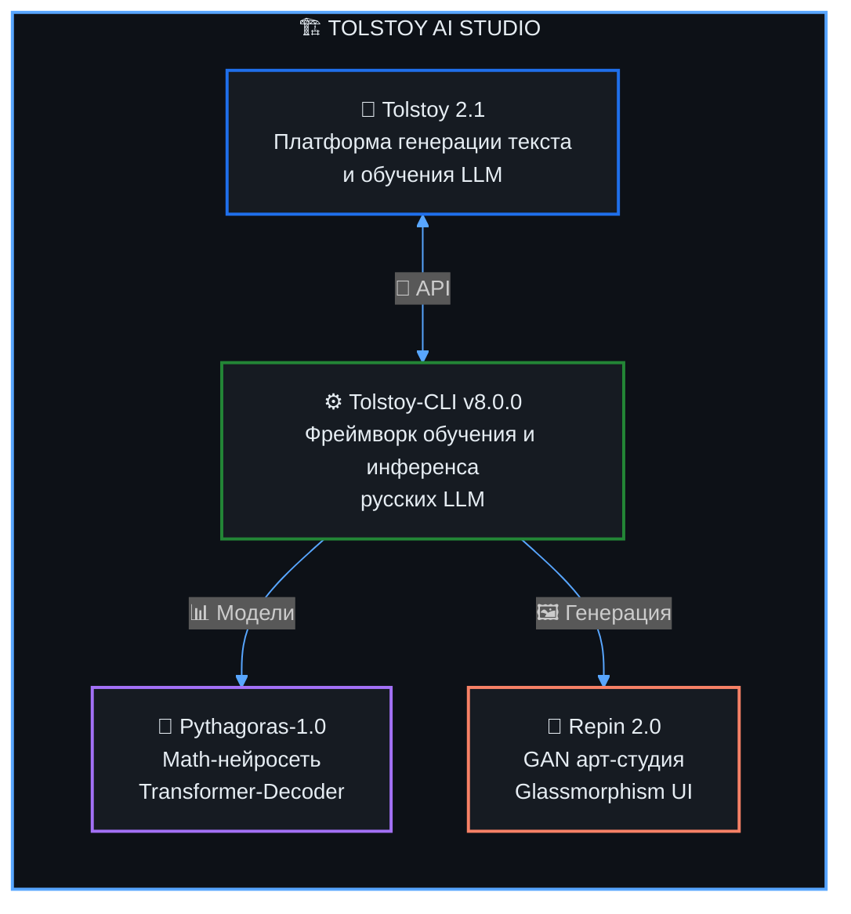

<div align="center">

<!-- Волновой баннер -->

<!-- Анимированный текст -->
<a href="https://git.io/typing-svg">
  
</a>

<!-- Статус -->
<p>
  
  
  
</p>

<!-- Контактные бейджи -->
<p>
  <a href="https://t.me/ultrahyperus"></a>
  <a href="mailto:takeshelgaas@gmail.com"></a>
  <a href="https://github.com/zzzigrok"></a>
</p>

<!-- Счётчик посещений -->


</div>

<!-- ═══════════════════════════════════════════════════════════ -->

## 👨‍💻 Обо мне

```yaml
name:        Григорий
location:    Москва, Россия 🇷🇺
role:        AI Engineer & LLM Developer
focus:       Local-first AI / Russian-language LLMs
philosophy:  "Building things that think"
```

Я занимаюсь проектированием **автономных AI-систем**, которые работают на потребительском железе — без облаков, без подписок и без зависимости от чужих API. Меня не устраивает модель «заплати за токен и молись на uptime», поэтому я строю альтернативу: полноценный локальный AI-стек, где пользователь сам контролирует модель, данные и стоимость. Это инженерная позиция, а не идеологическая — просто в долгосрочной перспективе локальный инференс всегда дешевле и стабильнее облачного.

Мой основной фокус — **русскоязычные LLM**: обучение, тонкая настройка, квантизация и инференс на архитектурах от `llama.cpp` до кастомных Transformer-декодеров. Я глубоко работаю с механизмами внимания (GQA, RoPE, MoE) и не боюсь спускаться на уровень математики и C++, когда PyTorch перестаёт справляться. Особый интерес представляют методы эффективного обучения — QLoRA, GaLore, DoRA — которые позволяют дообучать модели заметно большего размера, чем позволяет «наивная» оценка VRAM.

Помимо текстовых моделей я занимаюсь **математическими нейросетями** (Pythagoras — Transformer-Decoder для арифметических задач) и **генеративным искусством** (Repin — GAN-студия с glassmorphism UI). Все эти проекты объединены в экосистему **Tolstoy AI Studio** — мой долгосрочный конструкторский эксперимент по созданию суверенной AI-инфраструктуры. Я верю, что для русскоязычного AI-комьюнити критически важно иметь собственные инструменты, датасеты и модели, а не полагаться на перевод англоязычных решений.

В свободное время ковыряюсь в высшей математике, оптимизирую алгоритмы и пишу инженерные инструменты — от chaos-прокси до парсеров. Считаю, что хороший AI-engineer должен уметь и обучать сеть, и развернуть её в проде, и написать CLI, которым будет приятно пользоваться. Если вы разделяете этот подход — давайте знакомиться.

<table>
<tr>
<td>🔭</td>
<td><b>Сейчас развиваю</b></td>
<td><code>Tolstoy AI Studio</code> — комплексную экосистему для русскоязычных LLM</td>
</tr>
<tr>
<td>🧠</td>
<td><b>В фокусе</b></td>
<td>llama.cpp, MoE, GQA, RoPE, Transformer-архитектуры, GAN</td>
</tr>
<tr>
<td>🎓</td>
<td><b>Интересы</b></td>
<td>Высшая математика, проектирование AI-систем, оптимизация алгоритмов</td>
</tr>
<tr>
<td>⚡</td>
<td><b>Инструменты</b></td>
<td>WSL 2, CMake, OpenRouter API, Polza.ai</td>
</tr>
<tr>
<td>🤝</td>
<td><b>Открыт к</b></td>
<td>Коллаборациям по open-source AI, локальным LLM и dev-tools</td>
</tr>
</table>

<!-- ═══════════════════════════════════════════════════════════ -->

## 📚 Сейчас изучаю

<table>
<tr>
<td width="50%">

**📄 Паперы**
- *Mixture-of-Experts* — DeepSeek-V3, Mixtral
- *Long-context attention* — RingAttention, FlashAttention-3
- *Efficient fine-tuning* — QLoRA, DoRA, GaLore
- *Speculative decoding* — Medusa, EAGLE-2

</td>
<td width="50%">

**🛠 Технологии**
- `vLLM` и `sglang` — high-throughput inference
- `TensorRT-LLM` — NVIDIA-оптимизация
- `ONNX Runtime` — кросс-платформенный инференс
- `Rust` — системное программирование для AI-tools

</td>
</tr>
<tr>
<td width="50%">

**📖 Книги**
- *Designing Machine Learning Systems* — Chip Huyen
- *Deep Learning* — Goodfellow, Bengio, Courville
- *Build a Large Language Model (From Scratch)* — Sebastian Raschka

</td>
<td width="50%">

**🎯 Практики**
- Квантизация INT4/INT8 без потери качества
- Distillation крупных моделей в small
- Реализация attention с нуля на CUDA/Triton
- End-to-end RLHF/DPO пайплайны

</td>
</tr>
</table>

<!-- ═══════════════════════════════════════════════════════════ -->

## 🛠 Технологический стек

<div align="center">

#### Языки программирования
<p>
  
  
  
  
</p>

#### AI / ML / Deep Learning
<p>
  
  
  
  
  
</p>

#### Инфраструктура и инструменты
<p>
  
  
  
  
  
</p>

#### Веб-технологии
<p>
  
  
  
  
</p>

</div>

<!-- ═══════════════════════════════════════════════════════════ -->

## 🚀 Ключевые проекты

### 🧩 Экосистема Tolstoy AI Studio

> Автономная мультимодальная AI-экосистема — от генерации текста до математической логики и графики.
> Все компоненты работают **локально на потребительском железе**. Принципы: открытые форматы (GGUF), воспроизводимость обучения, нулевая зависимость от облачных API.



<table>
<tr>
<td width="50%">

#### ⚙️ [Tolstoy-CLI v8.0.0](https://github.com/zzzigrok/Tolstoy-CLI)
> Ультимативный фреймворк для обучения и инференса русскоязычных LLM на потребительском железе.

<p>
  
  
  
</p>

**Возможности:** end-to-end пайплайн от препроцессинга датасета до GGUF-квантизации, LoRA/QLoRA-адаптеры, мониторинг метрик в реальном времени, профилирование VRAM, шаблоны конфигов под популярные модели.

`Fine-tuning` `GGUF` `Quantization` `LoRA`

</td>
<td width="50%">

#### 🚀 [Tolstoy 2.1](https://github.com/zzzigrok/tolstoy-2.1)
> Профессиональная платформа для генерации текста и обучения LLM с премиальным веб-интерфейсом.

<p>
  
  
  
</p>

**Возможности:** мульти-модельный чат, сравнение ответов side-by-side, шаблоны промптов, dark/light темы, история диалогов, экспорт сессий в JSON, hot-swap моделей без перезапуска.

`Web Platform` `LLM` `GitHub Pages`

</td>
</tr>
<tr>
<td width="50%">

#### 📐 [Pythagoras-1.0](https://github.com/zzzigrok/Pythagoras-1.0)
> Специализированная математическая нейросеть на архитектуре Transformer-Decoder.

<p>
  
  
  
</p>

**Возможности:** пошаговое решение арифметических задач, кастомный токенизатор чисел, обучение на синтетическом датасете с генератором примеров, трейн/валидация с early stopping, интерпретация attention-карт.

`Transformer` `Mathematics` `Deep Learning`

</td>
<td width="50%">

#### 🎨 [Repin 2.0](https://github.com/zzzigrok/repin-2.0)
> Мощная арт-студия на базе GAN с веб-витриной в стиле Glassmorphism и CLI.

<p>
  
  
  
</p>

**Возможности:** Progressive GAN, генерация в высоком разрешении, чекпойнты по эпохам, CLI-batch генерация, gallery-режим для просмотра результатов, экспорт в PNG/WebP.

`GAN` `Generative AI` `Glassmorphism`

</td>
</tr>
</table>

---

### 🔧 Инженерные инструменты

<table>
<tr>
<td width="33%">

#### 🌀 [ChaosWire](https://github.com/zzzigrok/chaoswire)
> Программируемый хаос-прокси L4/L7 на Go 1.24

<p>
  
  
</p>

Инъекция задержек, сброс соединений и ограничение полосы без перезапуска — через REST API или CLI. Идеально для тестирования отказоустойчивости микросервисов и chaos-экспериментов в CI.

`TCP` `HTTP` `Chaos Engineering` `Fault Injection`

</td>
<td width="33%">

#### 📚 [Chitai-Gorod Parser](https://github.com/zzzigrok/chitai-gorod-parser)
> Модульный асинхронный парсер книг

<p>
  
  
</p>

HTTP/2, ротация прокси, Playwright fallback, экспорт в CSV/XLSX. Архитектура plug-and-play: добавь новый источник за один класс-наследник.

`asyncio` `httpx` `Playwright` `Scraping`

</td>
<td width="33%">

#### 🧹 [RepoGroomer](https://github.com/zzzigrok/repogroomer)
> Локальный менеджер репозиториев

<p>
  
  
</p>

Найди мёртвые проекты, очисти кэш зависимостей, освободи место на диске. Анализирует `.git`, `node_modules`, `__pycache__`, `target/` и другие хранилища мусора.

`CLI` `DevTools` `Automation`

</td>
</tr>
</table>

<!-- ═══════════════════════════════════════════════════════════ -->

## 🧭 Инженерные принципы

Эти принципы направляют каждое архитектурное решение в моих проектах:

<table>
<tr>
<td width="50%">

**🏠 Local-first.** Модель и данные должны работать на машине пользователя. Облако — опция, не требование. Если инструмент ломается без интернета — это плохой инструмент.

**🔓 Open formats.** GGUF, ONNX, safetensors — никаких проприетарных контейнеров. Пользователь всегда может унести модель с собой и открыть в другом инструменте.

**📉 Cost-aware.** Каждый токен имеет цену. Локальный инференс = предсказуемая стоимость без сюрпризов в конце месяца и без rate-limit'ов.

</td>
<td width="50%">

**🔬 Reproducible.** Один seed → один результат. Препроцессинг, токенизация, веса — всё версионируется и логируется. Эксперимент без логов — не эксперимент.

**🇷🇺 Russian-native.** Качество на русском — первоклассный гражданин, не afterthought. Токенизатор и датасет рассчитаны под кириллицу с самого начала.

**⚙️ Pragmatic C++.** Когда PyTorch медленный — спускаюсь на уровень C++/CUDA. Когда не медленный — не спускаюсь. Инженерия, а не религия.

</td>
</tr>
</table>

<!-- ═══════════════════════════════════════════════════════════ -->

## 📊 GitHub Статистика

<div align="center">


&nbsp;&nbsp;&nbsp;


<br/><br/>

<!-- Streak -->


<br/><br/>

<!-- Activity Graph -->


</div>

<!-- ═══════════════════════════════════════════════════════════ -->

## 🐍 Контрибуции

<div align="center">
<picture>
  <source media="(prefers-color-scheme: dark)" srcset="https://raw.githubusercontent.com/zzzigrok/zzzigrok/output/github-snake-dark.svg" />
  <source media="(prefers-color-scheme: light)" srcset="https://raw.githubusercontent.com/zzzigrok/zzzigrok/output/github-snake.svg" />
  
</picture>
</div>

<!-- ═══════════════════════════════════════════════════════════ -->

## 🤝 Сотрудничество

> Открыт к коллаборациям по open-source AI, локальным LLM, dev-tools и инструментам для русскоязычного AI-комьюнити.

<table>
<tr>
<td width="33%" align="center">

**🤝 Help wanted**
В репозиториях Tolstoy AI Studio размечаю issues `help wanted` — приходите контрибьютить, объясню контекст.

</td>
<td width="33%" align="center">

**💬 Обсудим**
LLM-обучение, квантизация, локальный инференс — пишите в Telegram, отвечаю всем без исключения.

</td>
<td width="33%" align="center">

**🚀 Менторство**
Готов подсказать новичкам, которые входят в локальные LLM и хотят собирать свои модели с нуля.

</td>
</tr>
</table>

<!-- ═══════════════════════════════════════════════════════════ -->

<div align="center">

## 💡 Философия


<br/>

> *«Если модель не помещается в память моего ноутбука — это не моя модель.»*

<br/>

---


</div>
